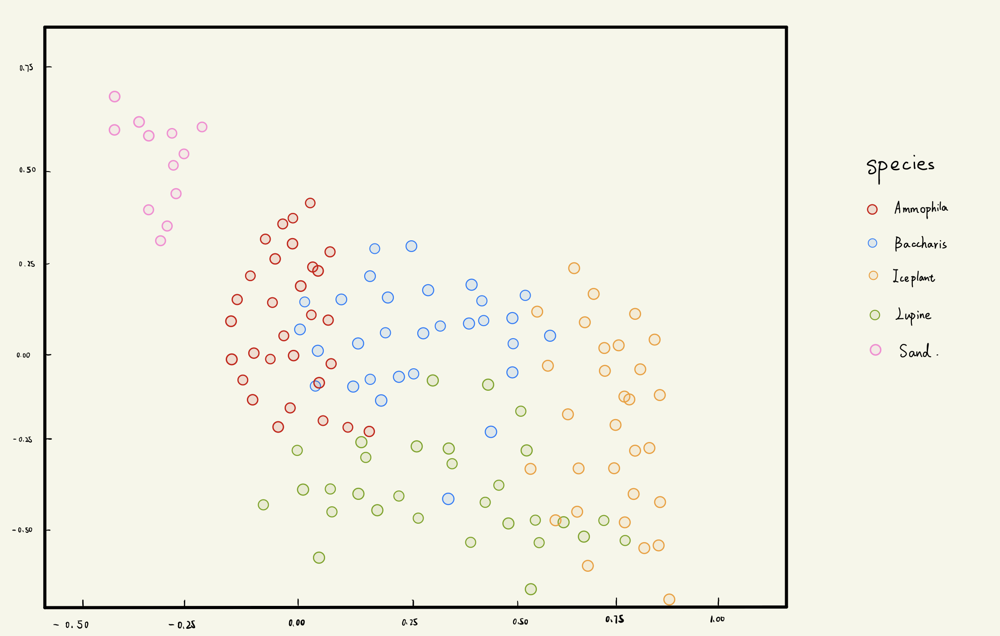
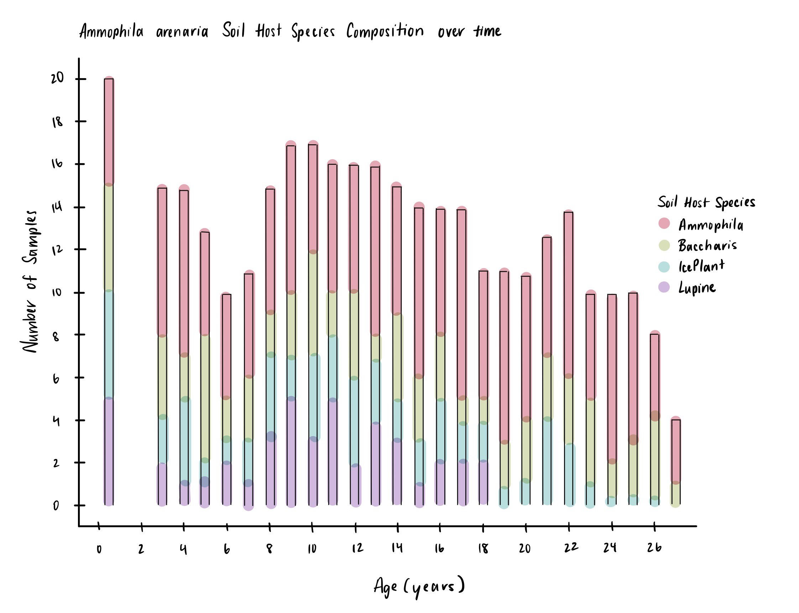
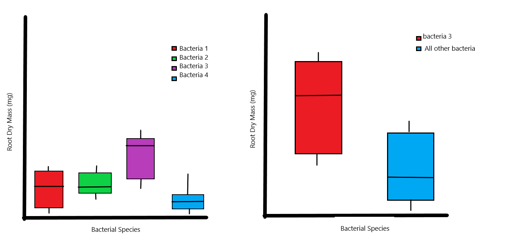
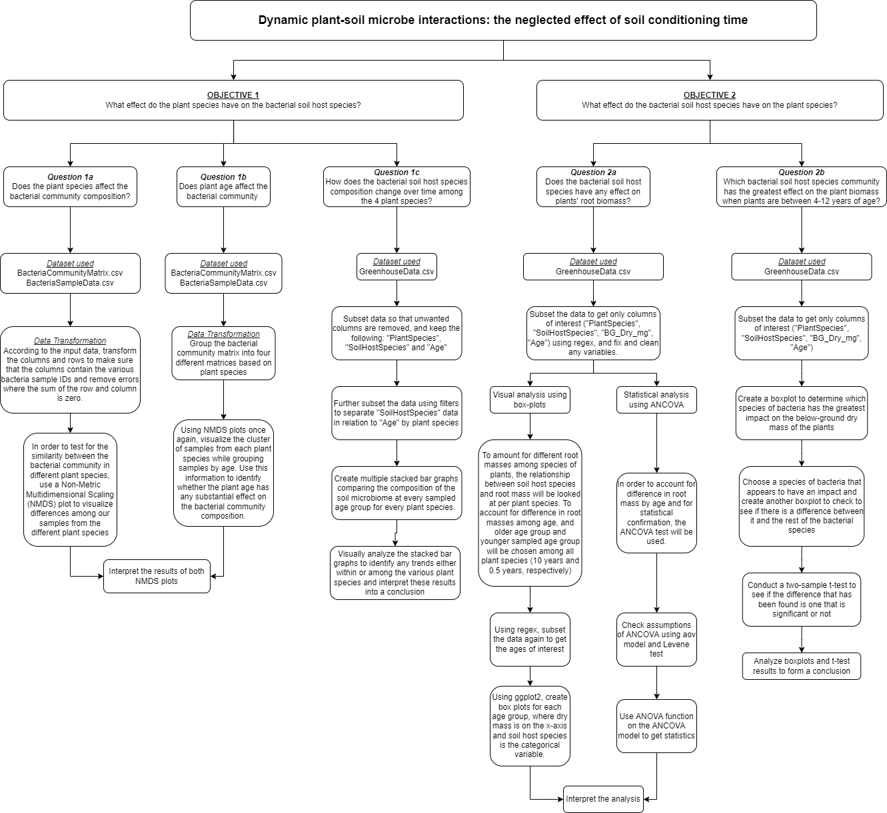

# Group 4 Project
Group 4 Project BIOL 432

Team Name: Up_All_Night-Rs

Team Members: Roshael Chellappah, Tram Duong, Tianyi Zuo, Malcolm Stewart

Github Repository: https://github.com/mstewart2000/GroupProject 

Dataset: https://zenodo.org/record/4716796#.Ykc8iG7MI1L

# Introduction
Soil microbial communities can play a key role in building plant communities. Also individual plants frequently cause changes in soil microbial community composition, and this reciprocal change then continues to affect the growth of neighboring plants or individual plants that subsequently colonize the soil. As this effect increases it can cause interspecific differences and thus affect plant community composition. In addition, the intensity of this interaction varies over time, so using the data that we found, we plan to investigate on how the intensity of the interaction between the studied plant and microbial populations vary over time. 

In our data, the experimenters mainly collected changes in the soil microbial community associated with individuals of four plant species for more than 20 years. Researchers collected soil & soil-dwelling microorganisms from four different plant species (dubbed soil host species) and transplanted seedlings of each of the four species into the different soil samples. The effect of soil microbial communities on the performance of conspecific and heterospecific seedlings was quantified in a greenhouse experiment that preserved the soil characteristics of these individual plants.

We used this data set to investigate the associated effects of and relationships between individual plants and soil microbes,  examining whether they change in intensity over time. Our research questions are as follows:

# Research Questions and Prediction
## Question 1. How the Plant effect Bacterial community composition?

####  a)Does the plant species affect the bacterial community composition?

####  b)Does the plant age affect the bacterial community?
  
####  c)How do the bacterial communities composition change across time as the various plant species age?
  
### Prediction 1a):
  Bacterial community composition differed between plant species, and in different plant species, bacterial composition changed with plant growth.
  
  Figure 1. NMDS plot show the overall variation in bacterial community composition among the different specific plant species. Sand group as a control group without any plant. That group will have large different with other four plant species. Other four plant species will be different with each other, and points will cluster together within same species. 

### Prediction 1c):
  Soil host species compositions will differ as plants age; however, each plant species will consistently have its related bacterial soil host species present in greater abundance throughout the years.

Figure 2. A predicted stacked bar graph showing the composition of the soil host species for *A. arenaria* throughout the sampled years. We predict that the Ammophila bateria species and the *A. arenaria* plant species are related, that this bacterial species will continue to be present in the soil microbiome of this plant species and will consistently be in greater abundance when comapred to the other bacteria species. We predict a similar trend for all other plant species as well.
  

## Question 2. How the Bacterial community affect the plant species?

####  a). Do bacteria communities have an effect on plant root mass (below-ground dry mass)?
####  b). Which bacteria has the greatest effect on plant biomass when the plant is 4-12 years old?
  
###  Prediction a): 
  Plant species will have increased below-ground dry mass when the soil host species and the plant species (transplanted seedling) are the same.

Figure 3. Box plot showing that when an Aa seedling of a particular age (Ammophila arenaria) is planted in soil that was hosted by Ammophila, the below-ground dry mass will be significantly higher than if an Aa seedling of that particular age is planted in soil that was from any other soil host species. The x-axis is the soil host species, while the y-axis shows the below-ground dry mass in milligrams.

Figure 4. Box plot showing that when a Ce seedling of a particular age (C. edulis/IcePlant) is planted in soil that was hosted by IcePlant, the below-ground dry mass will be significantly higher than if a Ce seedling of that particular age is planted in soil that was from any other soil host species. The x-axis is the soil host species, while the y-axis shows the below-ground dry mass in milligrams.

### Prediction b): 
  One of the four bacterial species will cause a significant difference in the below ground mass of the plants in this time frame.
  
  Figure 5/6. Shows the predicted relationship between the different species of soil bacteria and below ground dry mass as visualized by a boxplot. This shows the expected result that one of the species will apear to cause an increase in below ground dry mass. The next boxplot shows that this difference in fact exists by making the same boxplot but combining the other three bacterial species into a singular group.

### Workflow

### Literature Cited

Article: Ke, P., Zee, P. C., & Fukami, T. (2021). Dynamic plant–soil microbe interactions: the neglected effect of soil conditioning time. New Phytologist, 231(4), 1546–1558. https://doi.org/10.1111/nph.17420

Data Reference：Ke, P.-J., Zee, P., & Fukami, T. (2021). Dynamic plant-soil microbe interactions: the neglected effect of soil conditioning time. Zenodo. https://doi.org/10.5061/dryad.tmpg4f4zd
